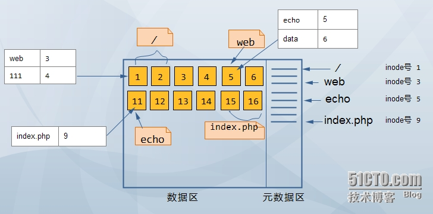

### HTTP

#### Http与Https的区别

|          | http | https             |
| -------- | ---- | ----------------- |
| 增加     |      | SSL, 安全套接字层 |
| 安全性   | 安全 | 不安全            |
| 标准端口 | 80   | 443               |

#### Http的无状态, 如何解决

- 无状态: 多次Http请求是独立的, 没有相互关系
- 解决: cookie和session
- 示例: 登录

#### URI与URL的区别

|              | URI                                          | URL                                       |
| ------------ | -------------------------------------------- | ----------------------------------------- |
| full-name    | *uniform resource identifier* 统一资源标识符 | *uniform resource locator* 统一资源定位器 |
| 关系         | 高层次的抽象概念                             | 具体的资源标识方式, 除了URL还有URN        |
| 组成         | 资源主机名 / 资源路径 / 资源名称             | 协议 / IP+端口 / 资源地址                 |
| 强调         | 资源唯一性                                   | 资源访问的唯一性                          |
| Java类库表现 | 解析资源                                     | 访问资源                                  |

- URN: *uniform resource name* 统一资源名称

#### Http请求报文和响应报文

参考: https://kb.cnblogs.com/page/55442

##### 请求报文(请求行/请求头/请求体)

- 请求头示例

  

  - 请求行: `GET /json/user2 HTTP/1.1`

- 字段说明

  - Date: 报文创建时间
  - Connection: 连接管理
  - Cache-Control: 缓存控制
  - Host: 主机
  - **Accept**: 传给服务器的媒体类型
  - **User-Agent**: 客户端(请求端/浏览器)信息

##### 响应报文(状态行/响应头/响应体)

- 响应头示例

  

  - 状态行: `HTTP1.1 200 OK`

- 字段说明

  - **Content-type**: 返回的媒体类型
  - **Content-length**: 返回数据长度

#### Http方法有哪些

| method | 解释                                       |
| ------ | ------------------------------------------ |
| GET    | 访问资源                                   |
| POST   | 传输数据到服务器, 非幂等(服务器会新增数据) |
| PUT    | 传输数据到服务器, 幂等(服务器不会新增数据) |
| DELETE | 删除资源                                   |
| HEAD   | 获取报文头信息                             |

#### Http状态码有哪些

| 状态码 | 对应英文              | 解释                                                         |
| ------ | --------------------- | ------------------------------------------------------------ |
| 200    | OK                    | 正常返回                                                     |
| 201    | Created               | 请求成功并创建新资源                                         |
| 301    | Moved Permanently     | 永久性重定向, 响应头Location为当前URL                        |
| 302    | Moded Temporarily     | 临时性重定向, 响应头Location为新临时性的URL                  |
| 304    | Not Modified          | 未修改, 直接读取本地资源即可, 常于If-Modified-Since和Last-Modified结合 |
| 400    | Bad Request           | 请求报文语法错误, 服务器无法解析                             |
| 401    | Unauthorized          | 未授权, 未登录访问受密码保护的页面会返回该状态码             |
| 403    | Forbidden             | 被禁止, 访问服务器设置不允许查看的内容                       |
| 404    | Not Found             | 找不到对应的资源                                             |
| 500    | Internal Server Error | 服务器内部发生错误                                           |
| 502    | Bad Gateway           | 作为网关或者代理工作的服务器尝试执行请求时, 从上游服务器接收到无效的响应 |
| 504    | Gateway Timeout       | 服务器响应超时                                               |

#### Https工作原理

参考: 

- https://blog.csdn.net/sean_cd/article/details/6966130(部分内容说法不正确, 如私钥部分, 请参考如下)
- https://www.cnblogs.com/zery/p/5164795.html(参考一和二部分即可)

##### 组成

- HTTP + SSL/TLS
  - SSL: *Secure Socket Layer* 安全套接字层
  - TLS: *Transport Layer Security* 传输安全层
- SSL与TLS的关系
  - 早期使用SSL进行加密
  - 目前使用TLS进行加密

##### 原理(如图)

1. 客户端**发送请求** https://www.domain.com

2. *crt private/crt public*  **私钥/公钥**

   - 采用https协议的服务器必须有一套数字证书
   - 数字证书可以自己制作, 也可以申请. 两者区别在于自己制作的证书需要浏览器验证, 而申请的证书浏览器会默认验证通过
   - 证书的主要部分为公钥和私钥, 对比于锁头和钥匙, 所以**公钥只能使用私钥解密**

3. *response with crt public*  **将公钥响应给浏览器**

   - 公钥就是证书
   - 证书中包含了颁发机构, 过期日期等信息

4. *validate crt*  **验证证书**

   - 验证证书是否有效, 如过期时间

   - *valid NO -> display https warning*  验证不通过 -> 弹出https警告
   - *valid YES -> generate random key*  验证通过 -> 生成随机key
   - *crypt with crt* -> 使用证书对随机key进行加密

5. *transfer crypted random key*  **传输加密后的随机key**

6. **解密随机key与加密内容**

   - *decrypt with private crt*  使用私钥解密传输内容
   - *get key*  解密后得到随机key
   - *crypt content with key*  使用随机key加密响应内容

7. *response crypted content with clinet key(random key)*  **响应随机key加密后的内容给浏览器**

8. *decrypt content with key*  **使用随机key解密响应内容**

##### 简化流程

- [客户端] 首次请求
- [服务端] 公钥返回, 私钥保留
- [客户端] 验证公钥, 生成随机key, 公钥加密随机key, 传输加密随机key
- [服务端] 私钥解密公钥, 获得随机key, 随机key加密响应内容
- [客户端] 随机key解密响应内容
- 客户端和服务端使用随机key加密与解密请求和响应
  - 客户端加密请求并解密响应
  - 服务端解密请求并加密响应

#### Http缺点

明文传输数据

#### Http1.1新特性

参考: https://www.cnblogs.com/gofighting/p/5421890.html

1. 长连接(Persistent Connection)和请求的流水线(Pipelining)处理
   - Http1.0中一次请求包含 建立TCP连接 -> 发送请求 -> 获得响应 -> 关闭连接 四个步骤
   - Http1.1允许在一次TCP连接中发送多个请求
   - Http1.1保持长连接的原因在于其在请求头中加入了Connection字段, 当其值为Keep-Alive时即可实现长连接
   - 请求的流水线表示客户端不用等待上一次请求的结果返回, 即可发出下一次请求
2. 增加host字段
   - 原因: 虚拟主机的出现, 共享一个物料服务器(IP)
   - Http1.1请求头和响应头中均有host字段, 如果没有该字段, 则返回400
3. 100状态码
   - 客户端事先发送一个头部请求(HEAD), 如果服务器拒绝, 则响应401, 否则响应100
   - 允许客户端在发送请求体之前先试探服务器, 如果服务器接收请求体则可发送请求
4. 分块传输(Chunked transfer-coding)
   - 响应头中Transfer-Encoding: chunked, 即表示分块传输
   - 响应内容较大时, 服务器就会分块传输
   - 最后返回一个空数据块表示传输完毕

#### Http优化方案

1. TCP复用
   - 负载均衡服务器的独特功能
   - 多个客户端HTTP请求复用到一个服务端TCP连接上
2. HTTP复用
   - Http1.1特性
   - 一个客户端的多个HTTP请求通过一个TCP连接进行处理
3. 内容缓存
   - 将静态内容缓存到客户端本地

***

上述参考: https://www.cnblogs.com/Java3y/p/8444033.html

#### GET与POST的区别

1. GET获取数据, POST存储数据
2. GET参数位于URL, 以?号开始, 以&分割; POST请求参数位于请求头或请求体中
3. GET传输数据量小, 不能大于2KB, 但效率高
4. POST传输数据量大, 文件上传只能使用POST
5. GET请求中文会进行转码, POST支持中文传输

#### 一次完整的Http请求步骤

参考: http://blog.51cto.com/linux5588/1351007(内容很详尽)

##### 详细描述

1. **域名解析**
   - 将域名解析为对应的IP和端口
   - 常规的解析流程为: 浏览器DNS缓存 -> 操作系统DNS缓存 -> 读取hosts文件 -> DNS服务器解析
   - 细节参考blog -> 1.域名解析
2. **发起TCP的3次握手**
   - 客户端(浏览器)以随机端口[1024, 65535] 向服务器的80/443端口发起TCP连接请求
   - 第1次: 客户端发送连接试探
   - 第2次: 服务端同意建立连接, 向客户端确认
   - 第3次: 客户端收到确认, 携带数据发送给服务端
   - 细节参考blog -> 2.发起TCP的3次握手
3. **建立TCP连接后发起Http请求**
4. **服务器处理请求, 并响应客户端(浏览器)**
   - 细节: 文件系统的寻找文件操作
5. **解析响应内容, 并渲染**
   - 如果服务器响应头中包含: `connection: keep-alive`, 则表明服务器和客户端的Http连接已经建立, 下次请求时服务器直接处理请求, 无需再发起TCP3次握手
   - 如果响应的是html, 则客户端会紧接着请求html中的静态资源(css, js, 图片等)

##### 文件系统的寻找文件操作

- 文件系统的最小存储单元为block(块), 默认为4096字节(4Kb)

- 一个文件在文件系统中会在两个区域分别存储: 数据区和元数据区

- 数据区存储文件的真实数据, 一个文件在数据区的存储不一定是连续的

- 元数据区类似于索引, 存储文件的类型/权限/**文件占据的block编号(数据区)**/等

- 一个文件在元数据区都有一个编号, 成为inode(index node)

- 文件目录在文件系统中和文件是相同的, 都需要在数据区和元数据区进行存储

- 文件目录在数据区存储的是 其下面的目录和文件 的名称和对应的inode号, 类似于映射

- 示例: 查找/web/echo/index.php文件的过程(目录结构以Linux为例, /为根目录)

  

  - 说明

    | 目录/文件 | 数据区占据       | 元数据区inode号 |
    | --------- | ---------------- | --------------- |
    | /目录     | block1, block2   | inode1          |
    | web目录   | block5           | inode3          |
    | echo目录  | block11          | inode5          |
    | index.php | block15, block16 | inode9          |

  - 步骤

    - 找到/目录在元数据区的inode号, 根据inode号找到/目录在数据区的block, 为block1, block2
    - block中存储了web目录的inode号, 为inode3
    - 找到元数据区的inode3, 根据inode号找到对应的数据区block, 为block5
    - ......如果看不懂, 参考blog -> 注2：寻找文件在文件系统层面是怎么操作的

#### Cookie与Session的区别

##### 解决问题

- Http无状态

#### Cookie

- 第一次请求, 服务器创建cookie, 并返回
- 第二次请求, 客户端在请求头中附带cookie数据, 传送给服务器

#### Session

- 会话cookie
- 第一次请求, 服务器创建session, 并返回给客户端该session对应的key(jsessionId)
- 第二次请求, 客户端在请求头中附带这样一个cookie, jsessionId=值, 则服务器根据传入的jsessionId值就能找到对应的session

| 维度     | cookie                                           | session                     |
| -------- | ------------------------------------------------ | --------------------------- |
| 数据存储 | 客户端                                           | 服务器                      |
| 安全性   | 不安全                                           | 安全                        |
| 限制     | 单个cookie最多4K数据, 客户端限制一个站点最多20个 | session较多会占用服务器资源 |

***

上述参考

- https://blog.csdn.net/qq_21808961/article/details/81025397
- https://blog.csdn.net/u013309870/article/details/77822665