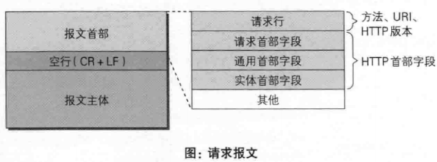
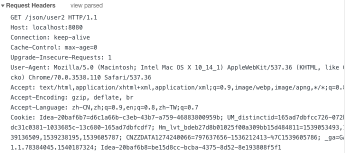
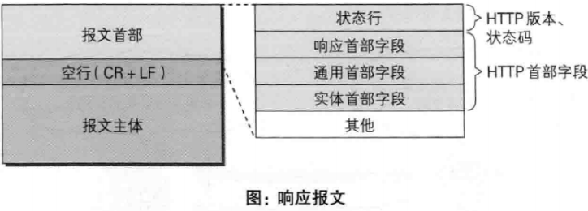
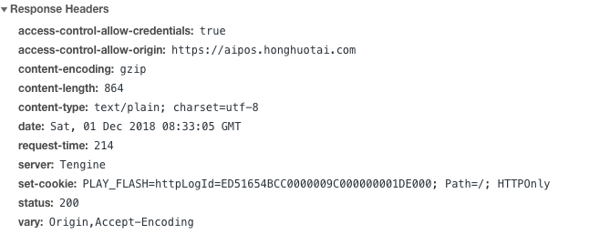

### HTTP

#### Http与Https的区别

|          | http | https             |
| -------- | ---- | ----------------- |
| 增加     |      | SSL, 安全套接字层 |
| 安全性   | 安全 | 不安全            |
| 标准端口 | 80   | 443               |

#### Http的无状态, 如何解决

- 无状态: 多次Http请求是独立的, 没有相互关系
- 解决: cookie和session
- 示例: 登录

#### URI与URL的区别

|              | URI                                          | URL                                       |
| ------------ | -------------------------------------------- | ----------------------------------------- |
| full-name    | *uniform resource identifier* 统一资源标识符 | *uniform resource locator* 统一资源定位器 |
| 关系         | 高层次的抽象概念                             | 具体的资源标识方式, 除了URL还有URN        |
| 组成         | 资源主机名 / 资源路径 / 资源名称             | 协议 / IP+端口 / 资源地址                 |
| 强调         | 资源唯一性                                   | 资源访问的唯一性                          |
| Java类库表现 | 解析资源                                     | 访问资源                                  |

- URN: *uniform resource name* 统一资源名称

#### Http请求报文和响应报文

##### 请求报文

- 请求头示例

  

  - 请求行: `GET /json/user2 HTTP/1.1`

- 字段说明

  - Date: 报文创建时间
  - Connection: 连接管理
  - Cache-Control: 缓存控制
  - Host: 主机
  - **Accept**: 传给服务器的媒体类型
  - **User-Agent**: 客户端(请求端/浏览器)信息

##### 响应报文

- 响应头示例

  

  - 状态行: `HTTP1.1 200 OK`

- 字段说明

  - **Content-type**: 返回的媒体类型
  - **Content-length**: 返回数据长度

#### Http方法有哪些

| method | 解释                                       |
| ------ | ------------------------------------------ |
| GET    | 访问资源                                   |
| POST   | 传输数据到服务器, 非幂等(服务器会新增数据) |
| PUT    | 传输数据到服务器, 幂等(服务器不会新增数据) |
| DELETE | 删除资源                                   |
| HEAD   | 获取报文头信息                             |

#### Http状态码有哪些

#### Https工作原理

#### Http1.1新特性

#### Http优化方案

***

上述参考: https://www.cnblogs.com/Java3y/p/8444033.html

#### GET与POST的区别

#### 一次完整的Http请求步骤

#### Cookie与Session的区别

#### Http缺点

***

上述参考

- https://blog.csdn.net/qq_21808961/article/details/81025397
- https://blog.csdn.net/u013309870/article/details/77822665