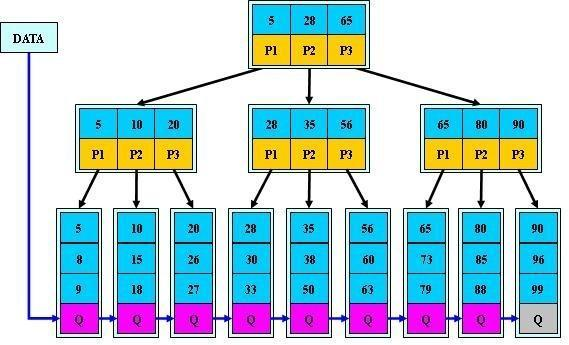
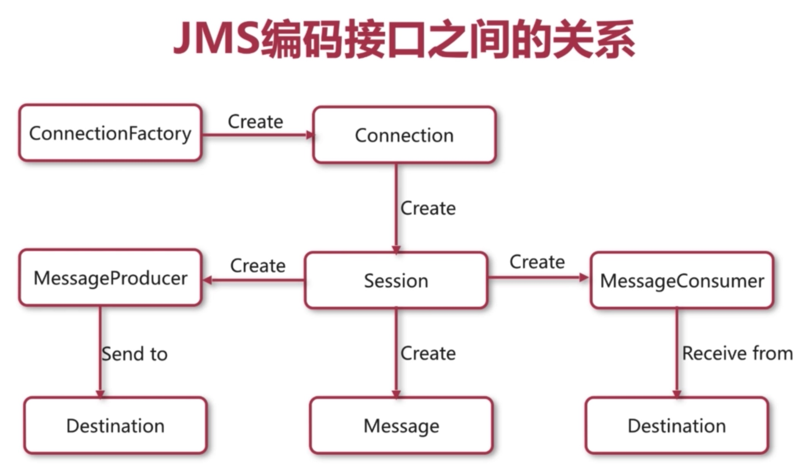

##### 集合框架(数据结构)

1. 掌握Collection和Map的继承体系
2. 掌握ArrayList, LinkedList, Vector, Stack, Queue, HashSet, TreeSet, LinkedHashSet, HashMap, TreeMap, LinkedHashMap, HashTable的特点和原理
3. 掌握ConcurrentHashMap的原理和适用场景


##### 算法

1. 掌握线性表和树的特点并熟练运用
2. 掌握常用排序和查找算法: 插入排序(直接插入排序, 希尔排序), 选择排序, 交换排序(冒泡排序, 快速排序), 顺序查找, 二分查找, 哈希查找
3. 几大基本算法: 贪心算法, 分治策略, 动态规划

##### 多线程

##### MQ

##### SSM源码

##### 数据库锁

##### 复杂SQL

##### 索引优化

##### JVM调优


#### 数据库

##### 存储过程

参考: https://www.2cto.com/database/201710/688377.html

1. 预编译SQL

2. 编译一次, 多次执行

3. 需要多次执行一系列SQL的情况, 比单独执行SQL快

4. 调用: 1) 数据库命令  2) 外部程序(Java程序)

5. 优缺点

   1. 预编译, 效率高
   2. 代码直接存储在数据库, 存储过程名调用. 减少网络通信
   3. 安全性高, 指定权限
   4. 重复使用, 减少工作量

6. 与函数的区别

   | 类型       | 存储过程                  | 函数                                 |
   | ---------- | ------------------------- | ------------------------------------ |
   | 特点       | 用于特定操作和任务        | 用于数据                             |
   | 头部声明   | procedure                 | function                             |
   | 返回类型   | 无需                      | 需要                                 |
   | 参数       | in/out/in out三种模式参数 | in/out/in out三种模式参数            |
   | 返回值     | out/in out返回零或多个值  | return返回一个值, 与声明返回类型一致 |
   | 独立PL/SQL | 可以                      | 不可以                               |
   | SQL中调用  | 不允许                    | 允许                                 |

##### 索引

参考: https://www.jianshu.com/p/e1dce41a6b2b

1. 特殊的查询表

2. 加速数据检索

3. 与书的目录类似

4. 无需查询全书即可找到想要的数据

5. 分类: 单列索引, 复合索引

6. 缺点: 减慢数据录入速度, 增加数据库尺寸

7. 哪些字段适合?
   1. 唯一
   2. 非空
   3. 经常查询
   4. 主键自动添加索引

8. 数据结构: B+Tree

   

   - 高级的二分查找, 减少I/O操作

   - 叶子节点存储关键字和指针, 关键字按照顺序排列

   - 非叶子节点存储叶子节点中最大/最小的关键字

   - 示例

     ```
     查找数据60
     1.I/O第一次：读入5、28、65 数据块，在此同级别节点块上，60在28到65之间(其实是二分查找)，那走P2指针指向的子树。
     2.I/O第二次：读入28、35、56 数据块，在此同级别节点块上，60大于56，所以走P3指针指向的子树(上图中就是叶子节点)。
     3.I/O第三次：读入叶子节点，在这个叶子节点中，使用二分查找算法找到目标值60。
     ```

9. 分类

   1. 聚簇索引(InnoDB主键索引) 和 非聚簇索引(MyISAM主键索引&二级索引)

      

      - 左上: 聚簇索引(主键索引)
      - 左下: 聚簇索引(二级索引)
      - 右: 非聚簇索引(主键索引 & 二级索引)

      |        维度        |   非聚簇索引    | 聚簇索引(主键索引) | 聚簇索引(二级索引) |
      | :----------------: | :-------------: | :----------------: | :----------------: |
      | 表数据和索引的存储 |    单独存储     |      一起存储      |      一起存储      |
      |      存储结构      |      B+树       |        B+树        |        B+树        |
      |    叶子节点存储    | 索引 + 记录地址 |       行数据       |       主键值       |
      |   非叶子阶段存储   |   索引关键字    |     索引关键字     |     索引关键字     |

      - 聚簇索引优缺点

      | 优点                                                        | 缺点                                                         |
      | ----------------------------------------------------------- | ------------------------------------------------------------ |
      | 数据按照顺序存储, **范围查找**速度高于非聚簇索引            | **插入**数据**速度**依赖插入**顺序**                         |
      | 表数据和索引一起存储, 定位到主键时比非聚簇索引**少一次I/O** | **二级索引**访问需要**两次索引查找**. 第一次查找主键值, 第二次根据主键值查找行数据 |
      |                                                             | **插入数据**比非聚簇索引**慢**. 因为要保证主键不能重复, 需要遍历所有的叶子节点, 但是聚簇索引的叶子节点存储的数据量比非聚簇索引多 |

   2. 唯一索引

      - 单列唯一索引, 复合唯一索引

10. 注意事项

   1. like条件中, 如果以%号开头, 则不会使用到索引
   2. 复合索引存在顺序, where条件中如果不是以复合索引的第一个列开头, 则不会使用该索引
   3. 复合索引中, 范围查找不会用到索引
   4. 避免创建过多索引, 因为索引会占用空间
   5. [数据库优化]where条件中, =/in查找放前面, 范围查找放后面
   6. [数据库优化]小表驱动大表. 即join时, 小表在左, 大表在右


##### 事务

参考: https://blog.csdn.net/aluomaidi/article/details/52460844

1. 一系列逻辑工作单元

2. 特点

   | 特点(ACID) | 说明                                 |
   | ---------- | ------------------------------------ |
   | 原子性     | 最小工作单元, 不可分割               |
   | 一致性     | 事务执行前后, 数据库状态是一致的     |
   | 隔离性     | 多个事务之间是相互隔离的             |
   | 持久性     | 事务操作结束, 对数据库的修改时永久的 |

3. 事务并发存在的问题

   - 示例: 表a, 字段count, 值100. 对其操作

   | 问题           | 描述                                                         |
   | -------------- | ------------------------------------------------------------ |
   | 第一类丢失更新 | 两个事务同时对一个数据操作. 一个事务成功, 一个事务失败       |
   | 第二类丢失更新 | 两个事务同时对一个数据操作. 两个都成功                       |
   | 脏读           | 一个事务读取到了另一个事务未提交的数据                       |
   | 不可重复读     | 一个事务多次查询数据, 得到不同的结果. (中间其他事务修改了数据) |
   | 幻读           | 多次查询一个数据库表的数据量, 得到不同结果. (中间进行了增删操作) |

4. 事务隔离级别

   | 名称     | 描述                                                         |
   | -------- | ------------------------------------------------------------ |
   | 读未提交 | 一个事务读取其他事务未提交的数据                             |
   | 读已提交 | 一个事务只能读取其他事务提交后的数据 **[Oracle, SQLServer默认级别]** |
   | 可重复读 | 一个事务多次读取数据, 结果相同 **[MySQL默认级别]**           |
   | 串行     | 不存在并发, 串行化                                           |

5. 事务隔离级别控制能力

   | 隔离级别 | 第一类丢失更新 | 脏读 | 不可重复读 | 第二类丢失更新 | 幻读 |
   | -------- | -------------- | ---- | ---------- | -------------- | ---- |
   | 读未提交 |                |      |            |                |      |
   | 读已提交 | Y              | Y    |            |                |      |
   | 可重复读 | Y              | Y    | Y          | Y              |      |
   | 串行     | Y              | Y    | Y          | Y              | Y    |


##### 数据库锁

1. 分类

   | 名称   | 性质             | 描述                                         |
   | ------ | ---------------- | -------------------------------------------- |
   | 悲观锁 | 数据库锁机制     | 一个事务修改数据, 其他事务也可能同时修改数据 |
   | 乐观锁 | 用户实现的所机制 | 一个事务修改数据, 其他事务不会同时修改数据   |

2. 悲观锁

   - 按性质划分

     | 名称   | 简称                 | 描述                                                         |
     | ------ | -------------------- | ------------------------------------------------------------ |
     | 共享锁 | S锁 [Share Lock]     | A事务对一个对象加S锁, 其他事务也要加S锁. 所有事务可读, A事务可写. A事务释放锁其他事务可写 |
     | 排它锁 | X锁 [Exclusive Lock] | A事务对一个对象加X锁, 其他事务不能加锁. A事务可读写. A事务释放锁其他事务可读写 |
     | 更新所 | U锁 [Update Lock]    | A事务对一个对象家U锁, 其他事务也加U锁. A事务更新操作时, U锁升级为X锁, 更新后还原为U锁. 目的为了防止死锁 |

     - 共享锁的死锁情况: A\B事务对对象加S锁, 执行更新操作. 此时, A\B事务的S锁会升级为X锁, 由于等待对方释放X锁, 所以形成死锁

   - 按作用范围划分

     | 名称 | 描述                                                         |
     | ---- | ------------------------------------------------------------ |
     | 行锁 | 数据库明确知道需要对哪些行加锁. 如update...where id = xx. 如果不明确, 则使用表锁 |
     | 表锁 | 对整个表加锁                                                 |

3. 乐观锁

   1. 作用范围

      - 并发少
      - 读多写少

   2. 性质: 乐观锁可以解决部分并发问题, 但是不能完全解决

   3. 实现方式

      | 名称       | 更新操作                                | 适用       |
      | ---------- | --------------------------------------- | ---------- |
      | 版本号     | update version + 1 where version = 传入 | 新系统设计 |
      | 时间戳     | update ts = now() where ts = 传入       | 新系统设计 |
      | 待更新字段 | update 字段 = 值 where 字段 = 传入      | 老系统维护 |
      | 所有字段   | 所有字段做版本控制                      | 老系统维护 |

##### 数据库优化

参考: https://blog.csdn.net/a724888/article/details/60879893

1. 方式

   | 1    | 2    | 3      | 4        | 5    |
   | ---- | ---- | ------ | -------- | ---- |
   | SQL  | 索引 | 表结构 | 系统配置 | 硬件 |

2. 索引优化

   1. 以下情况不走索引
      - Like以%开头
      - is null 和 is not null
      - !=
      - 索引字段计算
      - 索引字段使用函数
   2. 索引列选择: 非空且唯一

3. SQL优化

   1. 减少以下关键字的使用: distinct, order by, union(使用union all替代), having, in, like('%')
   2. where语句中, 精准查询在前, 范围/模糊查询在后
   3. 避免使用临时表, 子查询

4. 分库, 分表, 读写分离

5. **高并发系统**

   1. 数据库优化
   2. 使用缓存, 减少数据库I/O
   3. 分布式
   4. 负载均衡


##### MQ(消息队列)

1. 作用: 解耦, 异步

2. JMS 和 AMQP

   | JMS                  | AMQP                              |
   | -------------------- | --------------------------------- |
   | Java Message Service | Advanced Message Queuing Protocal |
   | Java消息服务         | 高级消息队列协议                  |
   | J2EE规范             | 跨语言                            |

3. 常用的MQ

   | ActiveMQ   | RabbitMQ | Kafka          |
   | ---------- | -------- | -------------- |
   | Apache开发 | AMQP协议 | 吞吐看高       |
   | JMS规范    |          | 存在延迟和丢包 |

4. JMS相关概念

   | 名称          | 描述                  |
   | ------------- | --------------------- |
   | 提供者        | 消息中间件服务器      |
   | 客户端        | 发送/接收消息的程序   |
   | 生产者/消费者 | 发送/接收消息的客户端 |
   | 发布者/订阅者 | 发送/接收消息的客户端 |
   | 消息          | 传递的内容            |
   | 消息模式      | 队列 和 主题          |

5. 队列和主题

   | 队列模式                 | 主题模式                   |
   | ------------------------ | -------------------------- |
   | 生产者和消费者           | 发布者和订阅者             |
   | 消息只能被一个消费者消费 | 消息被所有订阅者消费       |
   | 消费者随时查看消息       | 订阅者只有订阅才能查看消息 |

6. JMS接口规范

   

   - ActiveMQ默认端口: 8161. 默认账号密码: admin

##### ActiveMQ面试题

参考: https://blog.csdn.net/belvine/article/details/79399798

1. ActiveMQ服务器宕机

   - 持久化消息: 硬盘; 非持久化消息: 内存


   - 减少非持久化消息
   - 对临时文件限制尽可能调大

2. 消息丢失

   - 使用持久化消息
   - 及时处理非持久化消息
   - 启用事务

3. 持久化消息慢

   - 持久化消息: 同步; 非持久化消息: 异步


   - 开启事务

4. 消息的不均匀消费

   - 消费者一次性获取一批消息
   - prefetch设置为1, 即每次处理一条消息

5. 死信队列

   - 消息退回->获取->处理报错6次, ActiveMQ会将消息放入死信队列