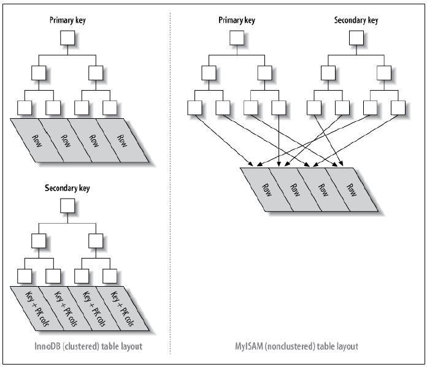

##### 集合框架(数据结构)

1. 掌握Collection和Map的继承体系
2. 掌握ArrayList, LinkedList, Vector, Stack, Queue, HashSet, TreeSet, LinkedHashSet, HashMap, TreeMap, LinkedHashMap, HashTable的特点和原理
3. 掌握ConcurrentHashMap的原理和适用场景


##### 算法

1. 掌握线性表和树的特点并熟练运用
2. 掌握常用排序和查找算法: 插入排序(直接插入排序, 希尔排序), 选择排序, 交换排序(冒泡排序, 快速排序), 顺序查找, 二分查找, 哈希查找
3. 几大基本算法: 贪心算法, 分治策略, 动态规划

##### 多线程

##### MQ

##### SSM源码

##### 数据库锁

##### 复杂SQL

##### 索引优化

##### JVM调优


#### 数据库

##### 存储过程

1. 预编译SQL

2. 编译一次, 多次执行

3. 需要多次执行一系列SQL的情况, 比单独执行SQL快

4. 调用: 1) 数据库命令  2) 外部程序(Java程序)

5. 优缺点

   1. 预编译, 效率高
   2. 代码直接存储在数据库, 存储过程名调用. 减少网络通信
   3. 安全性高, 指定权限
   4. 重复使用, 减少工作量

6. 与函数的区别

   | 类型       | 存储过程                  | 函数                                 |
   | ---------- | ------------------------- | ------------------------------------ |
   | 特点       | 用于特定操作和任务        | 用于数据                             |
   | 头部声明   | procedure                 | function                             |
   | 返回类型   | 无需                      | 需要                                 |
   | 参数       | in/out/in out三种模式参数 | in/out/in out三种模式参数            |
   | 返回值     | out/in out返回零或多个值  | return返回一个值, 与声明返回类型一致 |
   | 独立PL/SQL | 可以                      | 不可以                               |
   | SQL中调用  | 不允许                    | 允许                                 |

##### 索引

1. 特殊的查询表

2. 加速数据检索

3. 与书的目录类似

4. 无需查询全书即可找到想要的数据

5. 分类: 单列索引, 复合索引

6. 缺点: 减慢数据录入速度, 增加数据库尺寸

7. 哪些字段适合?
   1. 唯一
   2. 非空
   3. 经常查询
   4. 主键自动添加索引

8. 数据结构: B+Tree

   

   - 高级的二分查找, 减少I/O操作

   - 叶子节点存储关键字和指针, 关键字按照顺序排列

   - 非叶子节点存储叶子节点中最大/最小的关键字

   - 示例

     ```
     查找数据60
     1.I/O第一次：读入5、28、65 数据块，在此同级别节点块上，60在28到65之间(其实是二分查找)，那走P2指针指向的子树。
     2.I/O第二次：读入28、35、56 数据块，在此同级别节点块上，60大于56，所以走P3指针指向的子树(上图中就是叶子节点)。
     3.I/O第三次：读入叶子节点，在这个叶子节点中，使用二分查找算法找到目标值60。
     ```

9. 分类

   1. 聚簇索引(InnoDB主键索引) 和 非聚簇索引(MyISAM主键索引&二级索引)

      

      - 左上: 聚簇索引(主键索引)
      - 左下: 聚簇索引(二级索引)
      - 右: 非聚簇索引(主键索引 & 二级索引)

      |        维度        |   非聚簇索引    | 聚簇索引(主键索引) | 聚簇索引(二级索引) |
      | :----------------: | :-------------: | :----------------: | :----------------: |
      | 表数据和索引的存储 |    单独存储     |      一起存储      |      一起存储      |
      |      存储结构      |      B+树       |        B+树        |        B+树        |
      |    叶子节点存储    | 索引 + 记录地址 |       行数据       |       主键值       |
      |   非叶子阶段存储   |   索引关键字    |     索引关键字     |     索引关键字     |

      - 聚簇索引优缺点

      | 优点                                                        | 缺点                                                         |
      | ----------------------------------------------------------- | ------------------------------------------------------------ |
      | 数据按照顺序存储, **范围查找**速度高于非聚簇索引            | **插入**数据**速度**依赖插入**顺序**                         |
      | 表数据和索引一起存储, 定位到主键时比非聚簇索引**少一次I/O** | **二级索引**访问需要**两次索引查找**. 第一次查找主键值, 第二次根据主键值查找行数据 |
      |                                                             | **插入数据**比非聚簇索引**慢**. 因为要保证主键不能重复, 需要遍历所有的叶子节点, 但是聚簇索引的叶子节点存储的数据量比非聚簇索引多 |

   2. 唯一索引

      - 单列唯一索引, 复合唯一索引

10. 注意事项

   1. like条件中, 如果以%号开头, 则不会使用到索引
   2. 复合索引存在顺序, where条件中如果不是以复合索引的第一个列开头, 则不会使用该索引
   3. 复合索引中, 范围查找不会用到索引
   4. 避免创建过多索引, 因为索引会占用空间
   5. [数据库优化]where条件中, =/in查找放前面, 范围查找放后面
   6. [数据库优化]小表驱动大表. 即join时, 小表在左, 大表在右

